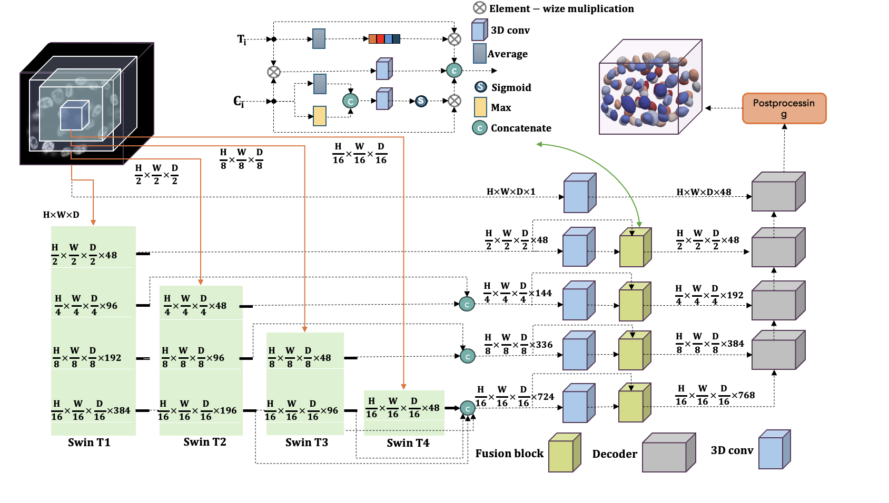
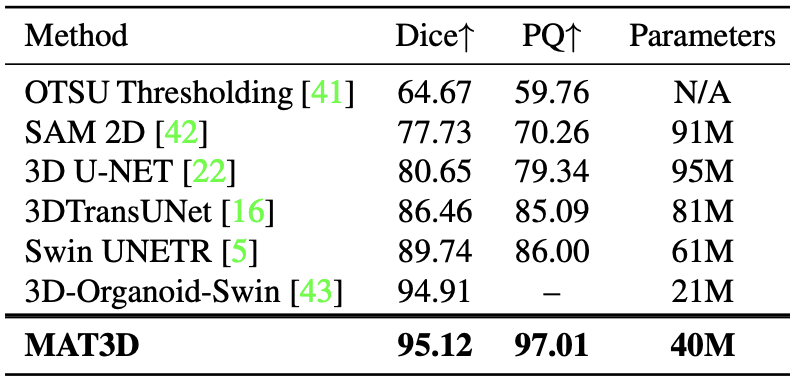
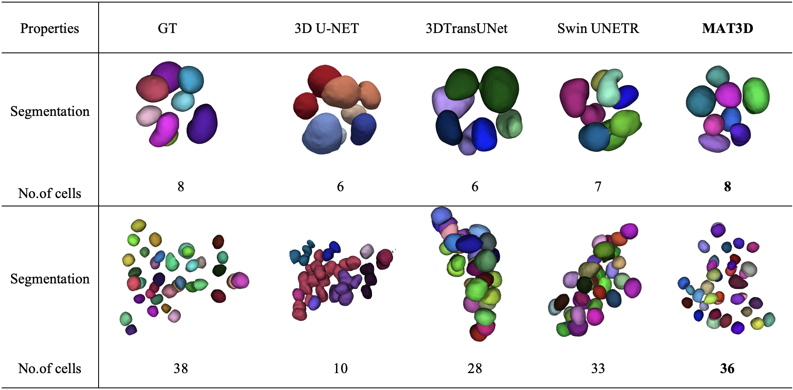
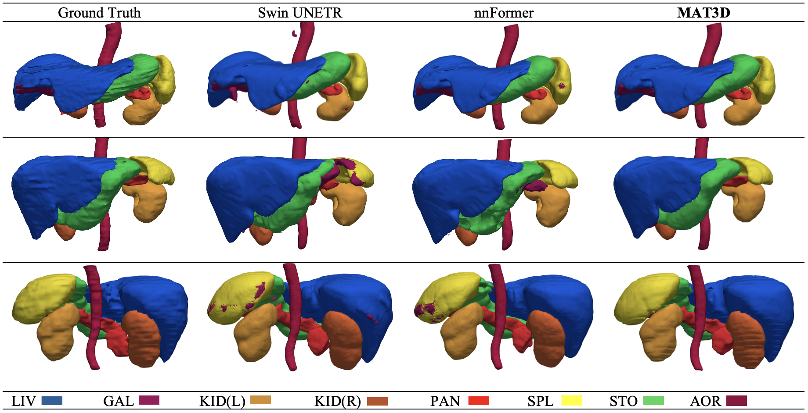

<div align="center">

  <h1>MAT3D</h1>
  <p>Multi-Aperture Transformers for 3D (MAT3D) Segmentation of Clinical and Microscopic Images!!</p>

📘 **Paper Link**: [Access the Paper](https://openaccess.thecvf.com/content/WACV2025/papers/Sohaib_Multi-Aperture_Transformers_for_3D_MAT3D_Segmentation_of_Clinical_and_Microscopic_WACV_2025_paper.pdf)

</div>

## 📜 Overview

MAT3D uses Multi-Aperture Transformers for accurate 3D segmentation in clinical and microscopic imaging

---
### 🌌  Framework
<div align="center">
  
</div>

---

## 🛠️ Environment Setup

Set up the environment for MAT3D as follows:

```bash
python3.10 -m venv MAT3D_env 
source MAT3D_env/bin/activate 
pip install -r requirements.txt
```

---

## 📂 Dataset

### 🔗 Download Links:
- [Synapse Multi-Organ Dataset](https://www.synapse.org/#!Synapse:syn3193805/wiki/89480)  
- [ACDC Challenge Dataset](https://www.creatis.insa-lyon.fr/Challenge/acdc/)

### 🗂️ Folder Structure:
Organize your data as follows:

```
data/  
├── imagesTr/  
│   ├── img1.nii.gz  
│   ├── img2.nii.gz  
├── labelsTr/  
│   ├── label1.nii.gz  
│   ├── label2.nii.gz  
├── dataset.json  
```

---

## 🚀 Running the Code

This repository is built upon the foundational work provided in [Synapse](https://github.com/LeonidAlekseev/Swin-UNETR).

### Training

Before training, configure the hyperparameters in the `config.py` file:

#### 🔧 Hyperparameter Configuration:
- **`data_dir`**: Path to the dataset.  
- **`saved_model_dir`**: Directory to save trained models and checkpoints.  
- **`num_samples`**: Number of samples for training.  
- **`num_classes`**: Number of target classes + background.  
- **`input_size`**: Dimensions of input images/data.  
- **`input_channels`**: Number of input channels (e.g., grayscale=1, RGB=3).  
- **`feature_size`**: Size of feature vectors extracted by the model.  
- **`use_checkpoint`**: Enable/disable model checkpointing.  
- **`learning_rate`**: Initial learning rate.  
- **`weight_decay`**: L2 penalty rate for regularization.  
- **`max_iterations`**: Maximum number of training iterations.  
- **`eval_num`**: Frequency of evaluations during training.

#### Start Training:
```bash
python3.10 main.py  
```

---

## 📊 Results

### Quantitative Results (Microscopic data):
<div align="center">
  
</div>

### Clinical data Visualization:
<div align="center">
  
</div>

### Microscopic data Visualization:

<div align="center">
  
  
</div>


## 📣 Citation

M. Sohaib, S. Shabani, S. A. Mohammed, G. Winkelmaier, and B. Parvin, “Multi-Aperture Transformers for 3D (MAT3D) Segmentation of Clinical and Microscopic Images,” in Proc. Winter Conference on Applications of Computer Vision (WACV), Feb. 2025, pp. 4352–4361.

---
